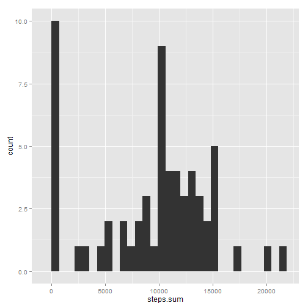
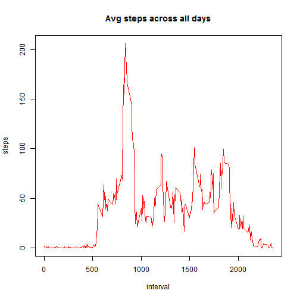
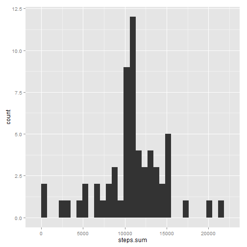
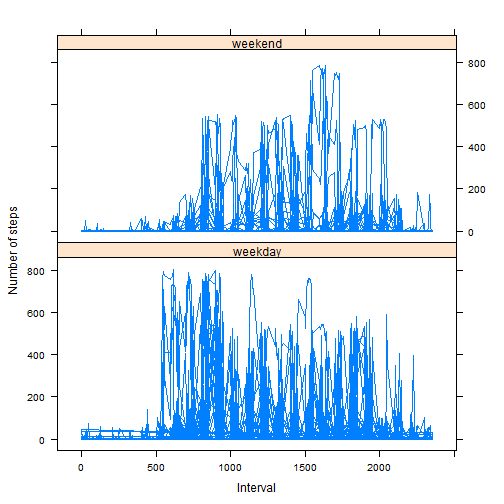

##Reproducible Research - Assignment 1##


*Source data and requirements were forked from https://github.com/rdpeng/RepData_PeerAssessment1.*

###Loading and preprocessing the data###

steps_smry shows the total, mean and the median steps taken per day:

```r
library(doBy)

steps_data <- read.csv("./activity.csv", header=TRUE)
steps_smry <- summaryBy(steps~date, data= steps_data, FUN = list(sum, mean, median), na.rm=TRUE)
head(steps_smry)
```

```
##         date steps.sum steps.mean steps.median
## 1 2012-10-01         0        NaN           NA
## 2 2012-10-02       126    0.43750            0
## 3 2012-10-03     11352   39.41667            0
## 4 2012-10-04     12116   42.06944            0
## 5 2012-10-05     13294   46.15972            0
## 6 2012-10-06     15420   53.54167            0
```


The following histogram shows the total number of steps taken each day:

```r
library(ggplot2)

ggplot(data = steps_smry) + geom_histogram(aes(x = steps.sum))
```

```
## stat_bin: binwidth defaulted to range/30. Use 'binwidth = x' to adjust this.
```

 

###What is mean total number of steps taken per day?###
###and What is the average daily activity pattern?###


The following shows the average steps for each 5 min. interval across all days
and a time series plot of the 5-minute interval (x-axis) and the average number of steps taken, averaged across all days (y-axis)

```r
avg_daily <- summaryBy(steps~interval, data= steps_data, FUN= list(mean), na.rm=TRUE)
head(avg_daily)
```

```
##   interval steps.mean
## 1        0  1.7169811
## 2        5  0.3396226
## 3       10  0.1320755
## 4       15  0.1509434
## 5       20  0.0754717
## 6       25  2.0943396
```

```r
plot(avg_daily, type="l", main="Avg steps across all days", col="red", ylab="steps", xlab="interval")
```

 


The  following shows the total number of steps for each 5 min interval across all days
and that the maximum number of steps was taken in tnterval 835:

```r
sum_daily <- summaryBy(steps~interval, data= steps_data, FUN= list(sum), na.rm=TRUE)
sum_daily[sum_daily$steps.sum == max(sum_daily$steps.sum), ]
```

```
##     interval steps.sum
## 104      835     10927
```

###Imputing missing values###


The source data had 2304 missing rows calculated as:

```r
count_na <- sum(is.na(steps_data))
count_na
```

```
## [1] 2304
```


The strategy adopted to populate the missing values was to use the mean steps for that interval
The new dataset is fill_data:

```r
fill_data <- cbind(steps_data, avg_daily$steps.mean)
colnames(fill_data)[4] <- "steps.mean"
fill_data$steps[is.na(fill_data$steps)] <- as.integer(fill_data$steps.mean[is.na(fill_data$steps)])
fill_data$steps.mean <- NULL
head(fill_data)
```

```
##   steps       date interval
## 1     1 2012-10-01        0
## 2     0 2012-10-01        5
## 3     0 2012-10-01       10
## 4     0 2012-10-01       15
## 5     0 2012-10-01       20
## 6     2 2012-10-01       25
```


Mean, Median and the Histogram of the total number of steps taken each day with the filled in data:

```r
smry_fill <- summaryBy(steps~date, data= fill_data, FUN = list(sum, mean, median))
head(smry_fill)
```

```
##         date steps.sum steps.mean steps.median
## 1 2012-10-01     10641   36.94792         33.5
## 2 2012-10-02       126    0.43750          0.0
## 3 2012-10-03     11352   39.41667          0.0
## 4 2012-10-04     12116   42.06944          0.0
## 5 2012-10-05     13294   46.15972          0.0
## 6 2012-10-06     15420   53.54167          0.0
```

```r
ggplot(data = smry_fill) + geom_histogram(aes(x = steps.sum))
```

```
## stat_bin: binwidth defaulted to range/30. Use 'binwidth = x' to adjust this.
```

 


Considering the histograms before and after I don't beleive that there is a marked difference between thr original data and the filled in data.


To create a new factor variable in the dataset with two levels - "weekday" and "weekend" indicating whether a given date is a weekday or weekend day:

```r
fill_data$date <- as.Date(fill_data$date, format = "%Y-%m-%d")
fill_data$day <- as.character(weekdays(fill_data$date))
fill_data$day <- ifelse(fill_data$day %in% c("Saturday", "Sunday"), "weekend", "weekday")
head(fill_data)
```

```
##   steps       date interval     day
## 1     1 2012-10-01        0 weekday
## 2     0 2012-10-01        5 weekday
## 3     0 2012-10-01       10 weekday
## 4     0 2012-10-01       15 weekday
## 5     0 2012-10-01       20 weekday
## 6     2 2012-10-01       25 weekday
```

###Are there differences in activity patterns between weekdays and weekends?###


And the following shows a panel plot containing a time series plot (i.e. type = "l") of the 5-minute interval (x-axis) and the average number of steps taken, averaged across all weekday days or weekend days (y-axis):

```r
library (lattice)
xyplot(steps ~ interval| day, 
       data = fill_data,
       type = "l",
       xlab = "Interval",
       ylab = "Number of steps",
       layout=c(1,2))
```

 


